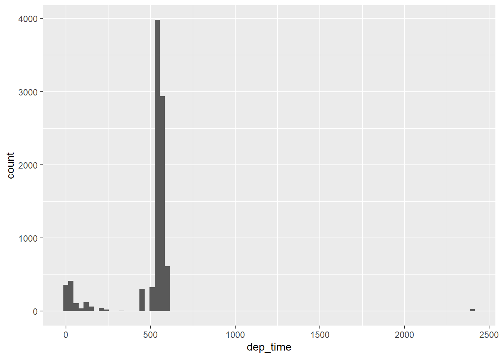

## Chapter 4  

### 4.4 Practice problems  

#### 4.4.1Keyboard Shortcut Help  
Why does this code not work?  

```
my_variable <- 10
my_varıable
#> Error in eval(expr, envir, enclos): object 'my_varıable' not found
```

Look carefully! (This may seem like an exercise in pointlessness, but training your brain to notice even the tiniest difference will pay off when programming.)  

** The same variable name wasn't used (not sure what was used in the place of "i") **  

#### 4.4.2
Tweak each of the following R commands so that they run correctly:  

```r
library(tidyverse)

ggplot(data = mpg) + 
  geom_point(mapping = aes(x = displ, y = hwy))
```

<!-- -->

```r
# not sure what is wrong with this one...
```


```r
#fliter(mpg, cyl = 8), command name spelled wrong, "==" in place of "=" for logical "is equal too"
filter(mpg, cyl == 8)
```

```
## # A tibble: 70 x 11
##    manufacturer model displ  year   cyl trans drv     cty   hwy fl    class
##    <chr>        <chr> <dbl> <int> <int> <chr> <chr> <int> <int> <chr> <chr>
##  1 audi         a6 q~   4.2  2008     8 auto~ 4        16    23 p     mids~
##  2 chevrolet    c150~   5.3  2008     8 auto~ r        14    20 r     suv  
##  3 chevrolet    c150~   5.3  2008     8 auto~ r        11    15 e     suv  
##  4 chevrolet    c150~   5.3  2008     8 auto~ r        14    20 r     suv  
##  5 chevrolet    c150~   5.7  1999     8 auto~ r        13    17 r     suv  
##  6 chevrolet    c150~   6    2008     8 auto~ r        12    17 r     suv  
##  7 chevrolet    corv~   5.7  1999     8 manu~ r        16    26 p     2sea~
##  8 chevrolet    corv~   5.7  1999     8 auto~ r        15    23 p     2sea~
##  9 chevrolet    corv~   6.2  2008     8 manu~ r        16    26 p     2sea~
## 10 chevrolet    corv~   6.2  2008     8 auto~ r        15    25 p     2sea~
## # ... with 60 more rows
```


```r
#filter(diamond, carat > 3), the data set is called "diamonds", not "diamond" 
filter(diamonds, carat >3)
```

```
## # A tibble: 32 x 10
##    carat cut     color clarity depth table price     x     y     z
##    <dbl> <ord>   <ord> <ord>   <dbl> <dbl> <int> <dbl> <dbl> <dbl>
##  1  3.01 Premium I     I1       62.7    58  8040  9.1   8.97  5.67
##  2  3.11 Fair    J     I1       65.9    57  9823  9.15  9.02  5.98
##  3  3.01 Premium F     I1       62.2    56  9925  9.24  9.13  5.73
##  4  3.05 Premium E     I1       60.9    58 10453  9.26  9.25  5.66
##  5  3.02 Fair    I     I1       65.2    56 10577  9.11  9.02  5.91
##  6  3.01 Fair    H     I1       56.1    62 10761  9.54  9.38  5.31
##  7  3.65 Fair    H     I1       67.1    53 11668  9.53  9.48  6.38
##  8  3.24 Premium H     I1       62.1    58 12300  9.44  9.4   5.85
##  9  3.22 Ideal   I     I1       62.6    55 12545  9.49  9.42  5.92
## 10  3.5  Ideal   H     I1       62.8    57 12587  9.65  9.59  6.03
## # ... with 22 more rows
```

#### 4.4.3  
Press Alt + Shift + K. What happens? How can you get to the same place using the menus?  
Alt + Shift + K brings up the keyboard shortcut guide for R! This can also be found under **Tools > Keyboard Shortcut Help**

## Chapter 5  

Assignment:  
* Read 5.1 - 5.7  
* Complete the following problems  
  + 5.2.4 Problems 1.1, 1.4, 1.5, 1.7, 2 and 3  
  + 5.3.1 Problems 1-4  
  + 5.4.1 Problems 1-4  
  + 5.5.2 Problems 1-5  
  + 5.6.7 Problem 5  
  
### 5.2

logical operators  

```r
#two different ways to filter for multiple values in the same variable
nov_dec1 <- filter(flights, month == 11 | month ==12)
nov_dec2 <- filter(flights, month %in% c(11,12))
```

### 5.5.4 Exercise  

for reference:  

```r
colnames(flights)
```

```
##  [1] "year"           "month"          "day"            "dep_time"      
##  [5] "sched_dep_time" "dep_delay"      "arr_time"       "sched_arr_time"
##  [9] "arr_delay"      "carrier"        "flight"         "tailnum"       
## [13] "origin"         "dest"           "air_time"       "distance"      
## [17] "hour"           "minute"         "time_hour"
```

#### 5.2.4.1.1 
Had an arrival delay of two or more hours  

```r
ex1.1 <- filter(flights, arr_delay >= 120) #arr_delay is in minutes
summary(ex1.1$arr_delay) # arr_delay minimum is 120
```

```
##    Min. 1st Qu.  Median    Mean 3rd Qu.    Max. 
##   120.0   137.0   163.0   184.2   207.0  1272.0
```

#### 5.2.4.1.4  
Departed in summer (July, August, and September)  

```r
ex1.4.1 = filter(flights, month == 7 | month == 8 | month == 9)
summary(ex1.4.1$month) # month range is 7-9
```

```
##    Min. 1st Qu.  Median    Mean 3rd Qu.    Max. 
##   7.000   7.000   8.000   7.979   9.000   9.000
```


```r
#alternate method
ex1.4.2 = filter(flights, month %in% c(7:9))
summary(ex1.4.2$month)
```

```
##    Min. 1st Qu.  Median    Mean 3rd Qu.    Max. 
##   7.000   7.000   8.000   7.979   9.000   9.000
```

#### 5.2.4.1.5  
Arrived more than two hours late, but didn’t leave late  

```r
ex1.5 = filter(flights, arr_delay > 120 & dep_delay <= 0)
summary(ex1.5) #looks good
```

```
##       year          month             day           dep_time   
##  Min.   :2013   Min.   : 1.000   Min.   : 1.00   Min.   : 558  
##  1st Qu.:2013   1st Qu.: 6.000   1st Qu.: 7.00   1st Qu.:1157  
##  Median :2013   Median : 7.000   Median :18.00   Median :1602  
##  Mean   :2013   Mean   : 6.655   Mean   :16.03   Mean   :1395  
##  3rd Qu.:2013   3rd Qu.: 8.000   3rd Qu.:22.00   3rd Qu.:1710  
##  Max.   :2013   Max.   :11.000   Max.   :30.00   Max.   :2052  
##  sched_dep_time   dep_delay          arr_time    sched_arr_time
##  Min.   : 600   Min.   :-11.000   Min.   :  13   Min.   : 814  
##  1st Qu.:1200   1st Qu.: -5.000   1st Qu.:1329   1st Qu.:1316  
##  Median :1605   Median : -3.000   Median :1858   Median :1831  
##  Mean   :1412   Mean   : -3.483   Mean   :1692   Mean   :1635  
##  3rd Qu.:1711   3rd Qu.: -2.000   3rd Qu.:2139   3rd Qu.:1951  
##  Max.   :2100   Max.   :  0.000   Max.   :2248   Max.   :2219  
##    arr_delay       carrier              flight       tailnum         
##  Min.   :121.0   Length:29          Min.   :   3   Length:29         
##  1st Qu.:124.0   Class :character   1st Qu.: 423   Class :character  
##  Median :129.0   Mode  :character   Median :1619   Mode  :character  
##  Mean   :134.1                      Mean   :2004                     
##  3rd Qu.:140.0                      3rd Qu.:3486                     
##  Max.   :194.0                      Max.   :5181                     
##     origin              dest              air_time        distance   
##  Length:29          Length:29          Min.   : 46.0   Min.   : 184  
##  Class :character   Class :character   1st Qu.: 90.0   1st Qu.: 479  
##  Mode  :character   Mode  :character   Median :158.0   Median : 812  
##                                        Mean   :184.9   Mean   :1154  
##                                        3rd Qu.:236.0   3rd Qu.:1598  
##                                        Max.   :386.0   Max.   :2586  
##       hour           minute        time_hour                  
##  Min.   : 6.00   Min.   : 0.00   Min.   :2013-01-27 14:00:00  
##  1st Qu.:12.00   1st Qu.: 0.00   1st Qu.:2013-06-05 16:00:00  
##  Median :16.00   Median :11.00   Median :2013-07-07 17:00:00  
##  Mean   :13.93   Mean   :18.83   Mean   :2013-07-06 11:28:57  
##  3rd Qu.:17.00   3rd Qu.:30.00   3rd Qu.:2013-08-08 15:00:00  
##  Max.   :21.00   Max.   :59.00   Max.   :2013-11-01 07:00:00
```

#### 5.2.4.1.7  
Departed between midnight and 6am (inclusive)  

```r
summary(flights$dep_time) #HMM or HHMM format, so I am looking for 2400 (midnight) and before 600 (6 am)
```

```
##    Min. 1st Qu.  Median    Mean 3rd Qu.    Max.    NA's 
##       1     907    1401    1349    1744    2400    8255
```


```r
ex1.7 <- filter(flights, dep_time == 2400 | dep_time <= 600 )
ggplot(ex1.7, aes(x= dep_time)) + geom_histogram(binwidth = 30) # looks good!
```

<!-- -->

#### 5.2.4.2  
Another useful dplyr filtering helper is between(). What does it do? Can you use it to simplify the code needed to answer the previous challenges?  

From between() help file "This is a shortcut for x >= left & x <= right". For departed in summer problem  

```r
ex_summer = filter(flights, between(month, 7, 9))
summary(ex_summer$month)
```

```
##    Min. 1st Qu.  Median    Mean 3rd Qu.    Max. 
##   7.000   7.000   8.000   7.979   9.000   9.000
```


#### 5.2.4.3  
How many flights have a missing dep_time? What other variables are missing? What might these rows represent?  

```r
no_depart = filter(flights, is.na(dep_time))
head(no_depart)
```

```
## # A tibble: 6 x 19
##    year month   day dep_time sched_dep_time dep_delay arr_time
##   <int> <int> <int>    <int>          <int>     <dbl>    <int>
## 1  2013     1     1       NA           1630        NA       NA
## 2  2013     1     1       NA           1935        NA       NA
## 3  2013     1     1       NA           1500        NA       NA
## 4  2013     1     1       NA            600        NA       NA
## 5  2013     1     2       NA           1540        NA       NA
## 6  2013     1     2       NA           1620        NA       NA
## # ... with 12 more variables: sched_arr_time <int>, arr_delay <dbl>,
## #   carrier <chr>, flight <int>, tailnum <chr>, origin <chr>, dest <chr>,
## #   air_time <dbl>, distance <dbl>, hour <dbl>, minute <dbl>,
## #   time_hour <dttm>
```

```r
summary(no_depart)
```

```
##       year          month             day          dep_time   
##  Min.   :2013   Min.   : 1.000   Min.   : 1.0   Min.   : NA   
##  1st Qu.:2013   1st Qu.: 3.000   1st Qu.: 8.0   1st Qu.: NA   
##  Median :2013   Median : 6.000   Median :12.0   Median : NA   
##  Mean   :2013   Mean   : 5.927   Mean   :14.6   Mean   :NaN   
##  3rd Qu.:2013   3rd Qu.: 8.000   3rd Qu.:23.0   3rd Qu.: NA   
##  Max.   :2013   Max.   :12.000   Max.   :31.0   Max.   : NA   
##                                                 NA's   :8255  
##  sched_dep_time   dep_delay       arr_time    sched_arr_time
##  Min.   : 106   Min.   : NA    Min.   : NA    Min.   :   1  
##  1st Qu.:1159   1st Qu.: NA    1st Qu.: NA    1st Qu.:1330  
##  Median :1559   Median : NA    Median : NA    Median :1749  
##  Mean   :1492   Mean   :NaN    Mean   :NaN    Mean   :1669  
##  3rd Qu.:1855   3rd Qu.: NA    3rd Qu.: NA    3rd Qu.:2049  
##  Max.   :2359   Max.   : NA    Max.   : NA    Max.   :2359  
##                 NA's   :8255   NA's   :8255                 
##    arr_delay      carrier              flight       tailnum         
##  Min.   : NA    Length:8255        Min.   :   1   Length:8255       
##  1st Qu.: NA    Class :character   1st Qu.:1577   Class :character  
##  Median : NA    Mode  :character   Median :3535   Mode  :character  
##  Mean   :NaN                       Mean   :3063                     
##  3rd Qu.: NA                       3rd Qu.:4373                     
##  Max.   : NA                       Max.   :6177                     
##  NA's   :8255                                                       
##     origin              dest              air_time       distance     
##  Length:8255        Length:8255        Min.   : NA    Min.   :  17.0  
##  Class :character   Class :character   1st Qu.: NA    1st Qu.: 292.0  
##  Mode  :character   Mode  :character   Median : NA    Median : 583.0  
##                                        Mean   :NaN    Mean   : 695.4  
##                                        3rd Qu.: NA    3rd Qu.: 872.0  
##                                        Max.   : NA    Max.   :4963.0  
##                                        NA's   :8255                   
##       hour           minute        time_hour                  
##  Min.   : 1.00   Min.   : 0.00   Min.   :2013-01-01 06:00:00  
##  1st Qu.:11.00   1st Qu.: 5.00   1st Qu.:2013-03-07 07:00:00  
##  Median :15.00   Median :27.00   Median :2013-06-12 18:00:00  
##  Mean   :14.67   Mean   :25.61   Mean   :2013-06-13 07:07:54  
##  3rd Qu.:18.00   3rd Qu.:42.00   3rd Qu.:2013-08-22 15:30:00  
##  Max.   :23.00   Max.   :59.00   Max.   :2013-12-31 20:00:00  
## 
```
It looks like there are NAs for dep_time, dep_delay, arr_time, arr_delay, air_time. These seem like cancelled flights.  

### 5.3 arrange()  

#### 5.3.1.1   
How could you use arrange() to sort all missing values to the start? (Hint: use is.na()).
first: check the help file for arrange. it was not helpful!  

```r
na_first = arrange(flights, desc(is.na(dep_time)))
dim(flights) == dim(na_first) #same dimensions
```

```
## [1] TRUE TRUE
```

```r
head(na_first) #header looks good
```

```
## # A tibble: 6 x 19
##    year month   day dep_time sched_dep_time dep_delay arr_time
##   <int> <int> <int>    <int>          <int>     <dbl>    <int>
## 1  2013     1     1       NA           1630        NA       NA
## 2  2013     1     1       NA           1935        NA       NA
## 3  2013     1     1       NA           1500        NA       NA
## 4  2013     1     1       NA            600        NA       NA
## 5  2013     1     2       NA           1540        NA       NA
## 6  2013     1     2       NA           1620        NA       NA
## # ... with 12 more variables: sched_arr_time <int>, arr_delay <dbl>,
## #   carrier <chr>, flight <int>, tailnum <chr>, origin <chr>, dest <chr>,
## #   air_time <dbl>, distance <dbl>, hour <dbl>, minute <dbl>,
## #   time_hour <dttm>
```

#### 5.3.1.2  
Sort flights to find the most delayed flights. Find the flights that left earliest.    

```r
#most delayed departure
arrange(flights, desc(dep_delay)) %>%
  head()
```

```
## # A tibble: 6 x 19
##    year month   day dep_time sched_dep_time dep_delay arr_time
##   <int> <int> <int>    <int>          <int>     <dbl>    <int>
## 1  2013     1     9      641            900      1301     1242
## 2  2013     6    15     1432           1935      1137     1607
## 3  2013     1    10     1121           1635      1126     1239
## 4  2013     9    20     1139           1845      1014     1457
## 5  2013     7    22      845           1600      1005     1044
## 6  2013     4    10     1100           1900       960     1342
## # ... with 12 more variables: sched_arr_time <int>, arr_delay <dbl>,
## #   carrier <chr>, flight <int>, tailnum <chr>, origin <chr>, dest <chr>,
## #   air_time <dbl>, distance <dbl>, hour <dbl>, minute <dbl>,
## #   time_hour <dttm>
```

```r
#Earliest departure
arrange(flights, dep_delay) %>%
  head() #leaving before they are scheduled!
```

```
## # A tibble: 6 x 19
##    year month   day dep_time sched_dep_time dep_delay arr_time
##   <int> <int> <int>    <int>          <int>     <dbl>    <int>
## 1  2013    12     7     2040           2123       -43       40
## 2  2013     2     3     2022           2055       -33     2240
## 3  2013    11    10     1408           1440       -32     1549
## 4  2013     1    11     1900           1930       -30     2233
## 5  2013     1    29     1703           1730       -27     1947
## 6  2013     8     9      729            755       -26     1002
## # ... with 12 more variables: sched_arr_time <int>, arr_delay <dbl>,
## #   carrier <chr>, flight <int>, tailnum <chr>, origin <chr>, dest <chr>,
## #   air_time <dbl>, distance <dbl>, hour <dbl>, minute <dbl>,
## #   time_hour <dttm>
```

#### 5.3.1.3  
Sort flights to find the fastest flights.  

```r
arrange(flights, air_time) %>%
  head()
```

```
## # A tibble: 6 x 19
##    year month   day dep_time sched_dep_time dep_delay arr_time
##   <int> <int> <int>    <int>          <int>     <dbl>    <int>
## 1  2013     1    16     1355           1315        40     1442
## 2  2013     4    13      537            527        10      622
## 3  2013    12     6      922            851        31     1021
## 4  2013     2     3     2153           2129        24     2247
## 5  2013     2     5     1303           1315       -12     1342
## 6  2013     2    12     2123           2130        -7     2211
## # ... with 12 more variables: sched_arr_time <int>, arr_delay <dbl>,
## #   carrier <chr>, flight <int>, tailnum <chr>, origin <chr>, dest <chr>,
## #   air_time <dbl>, distance <dbl>, hour <dbl>, minute <dbl>,
## #   time_hour <dttm>
```

#### 5.3.1.4  
Which flights travelled the longest? Which travelled the shortest?  

```r
#shortest distance
arrange(flights, distance) %>%
  head()
```

```
## # A tibble: 6 x 19
##    year month   day dep_time sched_dep_time dep_delay arr_time
##   <int> <int> <int>    <int>          <int>     <dbl>    <int>
## 1  2013     7    27       NA            106        NA       NA
## 2  2013     1     3     2127           2129        -2     2222
## 3  2013     1     4     1240           1200        40     1333
## 4  2013     1     4     1829           1615       134     1937
## 5  2013     1     4     2128           2129        -1     2218
## 6  2013     1     5     1155           1200        -5     1241
## # ... with 12 more variables: sched_arr_time <int>, arr_delay <dbl>,
## #   carrier <chr>, flight <int>, tailnum <chr>, origin <chr>, dest <chr>,
## #   air_time <dbl>, distance <dbl>, hour <dbl>, minute <dbl>,
## #   time_hour <dttm>
```


```r
#longest distance
arrange(flights, desc(distance)) %>%
  head() #vacationers got a looooong flight
```

```
## # A tibble: 6 x 19
##    year month   day dep_time sched_dep_time dep_delay arr_time
##   <int> <int> <int>    <int>          <int>     <dbl>    <int>
## 1  2013     1     1      857            900        -3     1516
## 2  2013     1     2      909            900         9     1525
## 3  2013     1     3      914            900        14     1504
## 4  2013     1     4      900            900         0     1516
## 5  2013     1     5      858            900        -2     1519
## 6  2013     1     6     1019            900        79     1558
## # ... with 12 more variables: sched_arr_time <int>, arr_delay <dbl>,
## #   carrier <chr>, flight <int>, tailnum <chr>, origin <chr>, dest <chr>,
## #   air_time <dbl>, distance <dbl>, hour <dbl>, minute <dbl>,
## #   time_hour <dttm>
```

### 5.4 select()  

#### 5.4.1.1  
Brainstorm as many ways as possible to select dep_time, dep_delay, arr_time, and arr_delay from flights.  
```
select(flights, dep_time, dep_delay, arr_time, arr_delay)
select(flights, starts_with("dep"), starts_with("arr"))
select(flights, ends_with("time"), ends_with("delay"), - air_time, - starts_with("sched"))
select(flights, 4, 6, 7, 9)
```

#### 5.4.1.2
What happens if you include the name of a variable multiple times in a select() call?  
Guess: it will select it twice

```r
head(select(flights, carrier, flight, carrier))
```

```
## # A tibble: 6 x 2
##   carrier flight
##   <chr>    <int>
## 1 UA        1545
## 2 UA        1714
## 3 AA        1141
## 4 B6         725
## 5 DL         461
## 6 UA        1696
```

```r
# only grabs it the first time it is called.
```

#### 5.4.1.3  
What does the one_of() function do? Why might it be helpful in conjunction with this vector?

```r
vars <- c("year", "month", "day", "dep_delay", "arr_delay")
select(flights, one_of(vars)) #selects what is in the vector. Seems to be the same as just using "vars".
```

```
## # A tibble: 336,776 x 5
##     year month   day dep_delay arr_delay
##    <int> <int> <int>     <dbl>     <dbl>
##  1  2013     1     1         2        11
##  2  2013     1     1         4        20
##  3  2013     1     1         2        33
##  4  2013     1     1        -1       -18
##  5  2013     1     1        -6       -25
##  6  2013     1     1        -4        12
##  7  2013     1     1        -5        19
##  8  2013     1     1        -3       -14
##  9  2013     1     1        -3        -8
## 10  2013     1     1        -2         8
## # ... with 336,766 more rows
```

```r
#select(flights, vars)
```

#### 5.4.1.4  
Does the result of running the following code surprise you? How do the select helpers deal with case by default? How can you change that default?  

```r
select(flights, contains("TIME"))
```

```
## # A tibble: 336,776 x 6
##    dep_time sched_dep_time arr_time sched_arr_time air_time
##       <int>          <int>    <int>          <int>    <dbl>
##  1      517            515      830            819      227
##  2      533            529      850            830      227
##  3      542            540      923            850      160
##  4      544            545     1004           1022      183
##  5      554            600      812            837      116
##  6      554            558      740            728      150
##  7      555            600      913            854      158
##  8      557            600      709            723       53
##  9      557            600      838            846      140
## 10      558            600      753            745      138
## # ... with 336,766 more rows, and 1 more variable: time_hour <dttm>
```
Selected everything that has time in the name, regardless of case. ignore.case is TRUE by default, can be set to FALSE to prevent non-specific matches by case.  

```r
select(flights, contains("TIME", ignore.case = FALSE))
```

```
## # A tibble: 336,776 x 0
```

### 5.5 mutate()  

#### 5.5.2.1
Currently dep_time and sched_dep_time are convenient to look at, but hard to compute with because they’re not really continuous numbers. Convert them to a more convenient representation of number of minutes since midnight.

```r
head(transmute(flights,
                 dep_time,
                 dep_minutes = dep_time %/% 100 *60 + dep_time %% 100,
                 sched_dep_minutes = sched_dep_time %/% 100 *60 + sched_dep_time %% 100))
```

```
## # A tibble: 6 x 3
##   dep_time dep_minutes sched_dep_minutes
##      <int>       <dbl>             <dbl>
## 1      517         317               315
## 2      533         333               329
## 3      542         342               340
## 4      544         344               345
## 5      554         354               360
## 6      554         354               358
```

#### 5.5.2.2
Compare air_time with arr_time - dep_time. What do you expect to see? What do you see? What do you need to do to fix it?  

```r
head(transmute(flights, 
               air_time,
               arr_dep = arr_time - dep_time))
```

```
## # A tibble: 6 x 2
##   air_time arr_dep
##      <dbl>   <int>
## 1      227     313
## 2      227     317
## 3      160     381
## 4      183     460
## 5      116     258
## 6      150     186
```
arr_time and dep_time need to be converted to minutes before calculating, as above.  

#### 5.5.2.3  
Compare dep_time, sched_dep_time, and dep_delay. How would you expect those three numbers to be related?  

```r
head(transmute(flights,
               dep_time,
               calc_dep_time = sched_dep_time + dep_delay,
               sched_dep_time,
               dep_delay))
```

```
## # A tibble: 6 x 4
##   dep_time calc_dep_time sched_dep_time dep_delay
##      <int>         <dbl>          <int>     <dbl>
## 1      517           517            515         2
## 2      533           533            529         4
## 3      542           542            540         2
## 4      544           544            545        -1
## 5      554           594            600        -6
## 6      554           554            558        -4
```
This should work for delays under an hour. dep_time and sched_dep_time must be converted as above before calculating calc_dep_time for flights delayed over an hour.  

#### 5.5.2.4
Find the 10 most delayed flights using a ranking function. How do you want to handle ties? Carefully read the documentation for min_rank().  

```r
delay_rank = transmute(flights, 
               flight,
               delay_ranking = min_rank(desc(dep_delay)),
               dep_delay) %>%
  arrange(delay_ranking)
head(delay_rank, 10)
```

```
## # A tibble: 10 x 3
##    flight delay_ranking dep_delay
##     <int>         <int>     <dbl>
##  1     51             1      1301
##  2   3535             2      1137
##  3   3695             3      1126
##  4    177             4      1014
##  5   3075             5      1005
##  6   2391             6       960
##  7   2119             7       911
##  8   2007             8       899
##  9   2047             9       898
## 10    172            10       896
```
Adjust what happens in a tie using (ties.method =  )  

#### 5.5.2.5  
What does 1:3 + 1:10 return? Why?  
```
1:3 + 1:10
#error: longer object length is not a multiple of shorter object length [1]  2  4  6  5  7  9  8 10 12 11
```  
R is unsure how to calculate when two vectors do not match in length or multiples of a length.  

### 5.6 summarise()   

#### 5.6.7.5
Which carrier has the worst delays? Challenge: can you disentangle the effects of bad airports vs. bad carriers? Why/why not? (Hint: think about flights %>% group_by(carrier, dest) %>% summarise(n())).  

```r
flights %>%
  group_by(carrier) %>%
  summarize(ave_delay = mean(dep_delay, na.rm = TRUE), n= n()) %>%
  filter(n >= 10000) %>%
  arrange(desc(ave_delay))
```

```
## # A tibble: 9 x 3
##   carrier ave_delay     n
##   <chr>       <dbl> <int>
## 1 EV          20.0  54173
## 2 WN          17.7  12275
## 3 9E          16.7  18460
## 4 B6          13.0  54635
## 5 UA          12.1  58665
## 6 MQ          10.6  26397
## 7 DL           9.26 48110
## 8 AA           8.59 32729
## 9 US           3.78 20536
```

