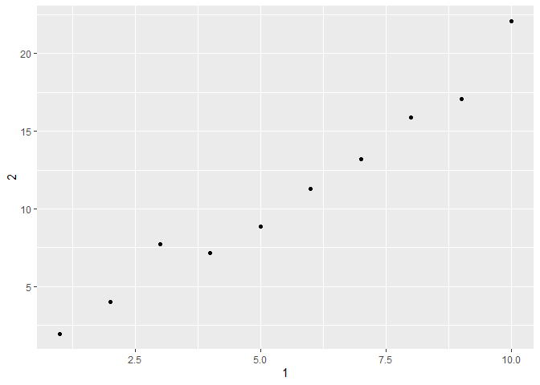

## Week 5 - R4DS Data Wrangling I (VT)  
#### August 8th/9th  
#### R4DS Chapter 9 - Introduction  
#### R4DS Chapter 10 - Tibbles  
* Read 10.1 - 10.4  
* 10.5 Problems 1-2, 4-5  

## Chapter 10 - Tibbles  

### 10.5 Practice problems  

#### 10.5.1 How can you tell if an object is a tibble? (Hint: try printing mtcars, which is a regular data frame).  

```r
print(mtcars)
```

```
##                      mpg cyl  disp  hp drat    wt  qsec vs am gear carb
## Mazda RX4           21.0   6 160.0 110 3.90 2.620 16.46  0  1    4    4
## Mazda RX4 Wag       21.0   6 160.0 110 3.90 2.875 17.02  0  1    4    4
## Datsun 710          22.8   4 108.0  93 3.85 2.320 18.61  1  1    4    1
## Hornet 4 Drive      21.4   6 258.0 110 3.08 3.215 19.44  1  0    3    1
## Hornet Sportabout   18.7   8 360.0 175 3.15 3.440 17.02  0  0    3    2
## Valiant             18.1   6 225.0 105 2.76 3.460 20.22  1  0    3    1
## Duster 360          14.3   8 360.0 245 3.21 3.570 15.84  0  0    3    4
## Merc 240D           24.4   4 146.7  62 3.69 3.190 20.00  1  0    4    2
## Merc 230            22.8   4 140.8  95 3.92 3.150 22.90  1  0    4    2
## Merc 280            19.2   6 167.6 123 3.92 3.440 18.30  1  0    4    4
## Merc 280C           17.8   6 167.6 123 3.92 3.440 18.90  1  0    4    4
## Merc 450SE          16.4   8 275.8 180 3.07 4.070 17.40  0  0    3    3
## Merc 450SL          17.3   8 275.8 180 3.07 3.730 17.60  0  0    3    3
## Merc 450SLC         15.2   8 275.8 180 3.07 3.780 18.00  0  0    3    3
## Cadillac Fleetwood  10.4   8 472.0 205 2.93 5.250 17.98  0  0    3    4
## Lincoln Continental 10.4   8 460.0 215 3.00 5.424 17.82  0  0    3    4
## Chrysler Imperial   14.7   8 440.0 230 3.23 5.345 17.42  0  0    3    4
## Fiat 128            32.4   4  78.7  66 4.08 2.200 19.47  1  1    4    1
## Honda Civic         30.4   4  75.7  52 4.93 1.615 18.52  1  1    4    2
## Toyota Corolla      33.9   4  71.1  65 4.22 1.835 19.90  1  1    4    1
## Toyota Corona       21.5   4 120.1  97 3.70 2.465 20.01  1  0    3    1
## Dodge Challenger    15.5   8 318.0 150 2.76 3.520 16.87  0  0    3    2
## AMC Javelin         15.2   8 304.0 150 3.15 3.435 17.30  0  0    3    2
## Camaro Z28          13.3   8 350.0 245 3.73 3.840 15.41  0  0    3    4
## Pontiac Firebird    19.2   8 400.0 175 3.08 3.845 17.05  0  0    3    2
## Fiat X1-9           27.3   4  79.0  66 4.08 1.935 18.90  1  1    4    1
## Porsche 914-2       26.0   4 120.3  91 4.43 2.140 16.70  0  1    5    2
## Lotus Europa        30.4   4  95.1 113 3.77 1.513 16.90  1  1    5    2
## Ford Pantera L      15.8   8 351.0 264 4.22 3.170 14.50  0  1    5    4
## Ferrari Dino        19.7   6 145.0 175 3.62 2.770 15.50  0  1    5    6
## Maserati Bora       15.0   8 301.0 335 3.54 3.570 14.60  0  1    5    8
## Volvo 142E          21.4   4 121.0 109 4.11 2.780 18.60  1  1    4    2
```


```r
mtcars_tib <- as_tibble(mtcars)
print(mtcars_tib)
```

```
## # A tibble: 32 x 11
##      mpg   cyl  disp    hp  drat    wt  qsec    vs    am  gear  carb
##    <dbl> <dbl> <dbl> <dbl> <dbl> <dbl> <dbl> <dbl> <dbl> <dbl> <dbl>
##  1  21       6  160    110  3.9   2.62  16.5     0     1     4     4
##  2  21       6  160    110  3.9   2.88  17.0     0     1     4     4
##  3  22.8     4  108     93  3.85  2.32  18.6     1     1     4     1
##  4  21.4     6  258    110  3.08  3.22  19.4     1     0     3     1
##  5  18.7     8  360    175  3.15  3.44  17.0     0     0     3     2
##  6  18.1     6  225    105  2.76  3.46  20.2     1     0     3     1
##  7  14.3     8  360    245  3.21  3.57  15.8     0     0     3     4
##  8  24.4     4  147.    62  3.69  3.19  20       1     0     4     2
##  9  22.8     4  141.    95  3.92  3.15  22.9     1     0     4     2
## 10  19.2     6  168.   123  3.92  3.44  18.3     1     0     4     4
## # ... with 22 more rows
```

There are no row names in the tibble. This is only a problem if you name your rows (so don't do that??)  

#### 10.5.2 Compare and contrast the following operations on a data.frame and equivalent tibble. What is different? Why might the default data frame behaviours cause you frustration?  


```r
df <- data.frame(abc = 1, xyz = "a")
df$x # matches to column named "xyz"
```

```
## [1] a
## Levels: a
```

```r
df[, "xyz"] # prints as a vector, lists factor levels
```

```
## [1] a
## Levels: a
```

```r
df[, c("abc", "xyz")]
```

```
##   abc xyz
## 1   1   a
```


```r
df_tib <- as_tibble(df)
df_tib$x # does not complete partial match, as in df
```

```
## Warning: Unknown or uninitialised column: 'x'.
```

```
## NULL
```

```r
df_tib[, "xyz"] #prints as a data frame
```

```
## # A tibble: 1 x 1
##   xyz  
##   <fct>
## 1 a
```

```r
df_tib[, c("abc", "xyz")] #idk if there is a difference
```

```
## # A tibble: 1 x 2
##     abc xyz  
##   <dbl> <fct>
## 1     1 a
```

#### 10.5.4 Practice referring to non-syntactic names in the following data frame by:  

```r
annoying <- tibble(
  `1` = 1:10,
  `2` = `1` * 2 + rnorm(length(`1`))
)
annoying
```

```
## # A tibble: 10 x 2
##      `1`   `2`
##    <int> <dbl>
##  1     1  1.96
##  2     2  4.03
##  3     3  7.73
##  4     4  7.14
##  5     5  8.85
##  6     6 11.3 
##  7     7 13.2 
##  8     8 15.9 
##  9     9 17.1 
## 10    10 22.1
```

Extracting the variable called 1.  

```r
annoying$`1`
```

```
##  [1]  1  2  3  4  5  6  7  8  9 10
```

```r
# or annoying$'1'
# or annoying$"1"
```

Plotting a scatterplot of 1 vs 2.  

```r
ggplot(data = annoying, aes(x = `1`, y = `2`)) +
  geom_point()
```

<!-- -->

Creating a new column called 3 which is 2 divided by 1.  

```r
annoying %>%
  mutate(`3` = `2`/`1`)
```

```
## # A tibble: 10 x 3
##      `1`   `2`   `3`
##    <int> <dbl> <dbl>
##  1     1  1.96  1.96
##  2     2  4.03  2.01
##  3     3  7.73  2.58
##  4     4  7.14  1.78
##  5     5  8.85  1.77
##  6     6 11.3   1.88
##  7     7 13.2   1.89
##  8     8 15.9   1.99
##  9     9 17.1   1.90
## 10    10 22.1   2.21
```

Renaming the columns to one, two and three.  

```r
#annoying %>%
#  rename(`1` = hi)
```
This is surprisingly hard...  

#### 10.5.5 What does tibble::enframe() do? When might you use it?  
enframe makes a tibble with a name column, might be useful if you have a df with column names?  

```r
#from help file
enframe(1:3)
```

```
## # A tibble: 3 x 2
##    name value
##   <int> <int>
## 1     1     1
## 2     2     2
## 3     3     3
```

```r
enframe(list(one = 1, two = 2:3, three = 4:6))
```

```
## # A tibble: 3 x 2
##   name  value    
##   <chr> <list>   
## 1 one   <dbl [1]>
## 2 two   <int [2]>
## 3 three <int [3]>
```

## Chapter 11 - Data import  
* Read 11.1 - 11.6  
* 11.2.2 Problems 1, 4 - 5  
* 11.3.5 Problems 1-3, 7  

### 11.2.2 Exercises  

#### 11.2.2.1 What function would you use to read a file where fields were separated with
“|”?  

```r
read_delim("a|b \n 1.0|2.0", delim = "|")
```

```
## # A tibble: 1 x 2
##   a       `b `
##   <chr>  <dbl>
## 1 " 1.0"     2
```

#### 11.2.2.4 Sometimes strings in a CSV file contain commas. To prevent them from causing problems they need to be surrounded by a quoting character, like " or '. By convention, read_csv() assumes that the quoting character will be ", and if you want to change it you’ll need to use read_delim() instead. What arguments do you need to specify to read the following text into a data frame?  

```r
read_delim("x,y \n 1,'a,b'", delim = ",", quote = "'") 
```

```
## # A tibble: 1 x 2
##   x     `y ` 
##   <chr> <chr>
## 1 " 1"  a,b
```

#### 11.2.2.5 Identify what is wrong with each of the following inline CSV files. What happens when you run the code?  

```r
read_csv("a,b \n 1,2,3 \n 4,5,6") 
```

```
## Warning: 2 parsing failures.
## row col  expected    actual         file
##   1  -- 2 columns 3 columns literal data
##   2  -- 2 columns 3 columns literal data
```

```
## # A tibble: 2 x 2
##       a     b
##   <dbl> <dbl>
## 1     1     2
## 2     4     5
```

```r
#there is no third column name so the thrid value in each row string is dropped
```

```r
read_csv("a,b,c \n 1,2 \n 1,2,3,4") 
```

```
## Warning: 2 parsing failures.
## row col  expected    actual         file
##   1  -- 3 columns 2 columns literal data
##   2  -- 3 columns 4 columns literal data
```

```
## # A tibble: 2 x 3
##       a     b     c
##   <dbl> <dbl> <dbl>
## 1     1     2    NA
## 2     1     2     3
```

```r
# row length does not match the coumn length. If too long the extra variables are dropped. If too short they are filled with NAs
```

```r
read_csv("a,b\n\"1")
```

```
## Warning: 2 parsing failures.
## row col                     expected    actual         file
##   1  a  closing quote at end of file           literal data
##   1  -- 2 columns                    1 columns literal data
```

```
## # A tibble: 1 x 2
##       a b    
##   <dbl> <chr>
## 1     1 <NA>
```

```r
#not enough varables to fill the columns, so b is left as NA
```

```r
read_csv("a,b\n1,2\na,b")
```

```
## # A tibble: 2 x 2
##   a     b    
##   <chr> <chr>
## 1 1     2    
## 2 a     b
```

```r
#not sure what is wrong here...
```

```r
read_csv("a;b\n1;3")
```

```
## # A tibble: 1 x 1
##   `a;b`
##   <chr>
## 1 1;3
```

```r
#wrong delim! use read_csv2()?
```

### 11.3.5 Exercises  

#### 11.3.5.1 What are the most important arguments to 'locale()'?  
it depends on what you are trying to parse! see the help file.   

#### 11.3.5.2

#### 11.3.5.3  

#### 11.3.5.7 
