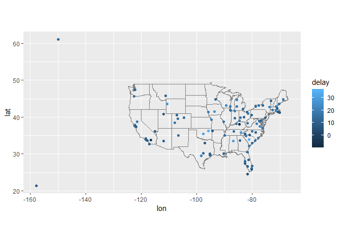

### Chapter 13 - Relational data  

* Read 13.1 - 13.7  
* 13.2.1 Problems 1 - 4  
* 13.3.1 Problems 1, 2.1, 2.2 (install the correct packages first!)  
* 13.4.6 Problems 1 and 2  
* 13.5.1 Problems 2 and 4  


Tools for using data from multiple related tables  
*Mutating joins*  
*Filtering joins*  
*Set operations*  


The airlines data sets:  
```
airlines #airline carrier names by abbreviation 
airports #airport info, duh
planes #plane by tailnum
weather #at NYC airports per hour
```

#### 13.2.1 Exercises  

*1. Imagine you wanted to draw (approximately) the route each plane flies from its origin to its destination. What variables would you need? What tables would you need to combine?*  

from flights, you need the origin and destination airport  
from airports, you will need lat and lon for each airport matched by FAA  
You would use a mutate join!  

*2. I forgot to draw the relationship between weather and airports. What is the relationship and how should it appear in the diagram?*  

```
weather$origin == airports$faa 
```  

*3. weather only contains information for the origin (NYC) airports. If it contained weather records for all airports in the USA, what additional relation would it define with flights?*  

weather would also match the destination in flights  

*4. We know that some days of the year are “special”, and fewer people than usual fly on them. How might you represent that data as a data frame? What would be the primary keys of that table? How would it connect to the existing tables?*  

table Special would include the following variables:  
* Year  
* Month  
* Day (connected to the same variables in flights and weather)  
* number of flights incoming to NYC 
* number of flights outgoing from NYC 

####13.3.1 Exercises  

*1. Add a surrogate key to flights.*  

```r
flights2 = flights

flights2$surr_key = 1:nrow(flights2)
head(flights2)
```

```
## # A tibble: 6 x 20
##    year month   day dep_time sched_dep_time dep_delay arr_time
##   <int> <int> <int>    <int>          <int>     <dbl>    <int>
## 1  2013     1     1      517            515         2      830
## 2  2013     1     1      533            529         4      850
## 3  2013     1     1      542            540         2      923
## 4  2013     1     1      544            545        -1     1004
## 5  2013     1     1      554            600        -6      812
## 6  2013     1     1      554            558        -4      740
## # ... with 13 more variables: sched_arr_time <int>, arr_delay <dbl>,
## #   carrier <chr>, flight <int>, tailnum <chr>, origin <chr>, dest <chr>,
## #   air_time <dbl>, distance <dbl>, hour <dbl>, minute <dbl>,
## #   time_hour <dttm>, surr_key <int>
```

*2. Identify the keys in the following datasets:*  
*Lahman::Batting*  

```r
library(Lahman)
head(Batting)
```

```
##    playerID yearID stint teamID lgID  G  AB  R  H X2B X3B HR RBI SB CS BB
## 1 abercda01   1871     1    TRO   NA  1   4  0  0   0   0  0   0  0  0  0
## 2  addybo01   1871     1    RC1   NA 25 118 30 32   6   0  0  13  8  1  4
## 3 allisar01   1871     1    CL1   NA 29 137 28 40   4   5  0  19  3  1  2
## 4 allisdo01   1871     1    WS3   NA 27 133 28 44  10   2  2  27  1  1  0
## 5 ansonca01   1871     1    RC1   NA 25 120 29 39  11   3  0  16  6  2  2
## 6 armstbo01   1871     1    FW1   NA 12  49  9 11   2   1  0   5  0  1  0
##   SO IBB HBP SH SF GIDP
## 1  0  NA  NA NA NA    0
## 2  0  NA  NA NA NA    0
## 3  5  NA  NA NA NA    1
## 4  2  NA  NA NA NA    0
## 5  1  NA  NA NA NA    0
## 6  1  NA  NA NA NA    0
```

```r
Batting %>% count(playerID, yearID, stint) %>% filter(n>1) 
```

```
## # A tibble: 0 x 4
## # ... with 4 variables: playerID <chr>, yearID <int>, stint <int>, n <int>
```

```r
#this is dumb
```

*babynames::babynames*  

```r
library(babynames)
head(babynames)
```

```
## # A tibble: 6 x 5
##    year sex   name          n   prop
##   <dbl> <chr> <chr>     <int>  <dbl>
## 1  1880 F     Mary       7065 0.0724
## 2  1880 F     Anna       2604 0.0267
## 3  1880 F     Emma       2003 0.0205
## 4  1880 F     Elizabeth  1939 0.0199
## 5  1880 F     Minnie     1746 0.0179
## 6  1880 F     Margaret   1578 0.0162
```

```r
babynames %>% count(year, name, sex) %>% filter(n>1)
```

```
## # A tibble: 0 x 4
## # ... with 4 variables: year <dbl>, name <chr>, sex <chr>, n <int>
```

#### 13.4.6 Exercises  

*1. Compute the average delay by destination, then join on the airports data frame so you can show the spatial distribution of delays. Here’s an easy way to draw a map of the United States:*  


```r
flights2 <- flights %>% 
  group_by(dest) %>%
  summarize(delay = mean(dep_delay, na.rm = TRUE))
head(flights2)
```

```
## # A tibble: 6 x 2
##   dest  delay
##   <chr> <dbl>
## 1 ABQ   13.7 
## 2 ACK    6.46
## 3 ALB   23.6 
## 4 ANC   12.9 
## 5 ATL   12.5 
## 6 AUS   13.0
```


```r
airports %>%
  right_join(flights2, c("faa" = "dest")) %>%
  ggplot(aes(lon, lat, color = delay)) +
    borders("state") +
    geom_point() +
    coord_quickmap()
```

```
## Warning: Removed 4 rows containing missing values (geom_point).
```

<!-- -->

*2. Add the location of the origin and destination (i.e. the lat and lon) to flights*  

```r
flights_loc1 <- flights %>%
  left_join(airports, by = c("origin" = "faa")) %>%
  left_join(airports, by = c("dest" = "faa")) %>%
  view()

#then select and clean this up
```

#### 13.5.1 Exercises  

*2. Filter flights to only show flights with planes that have flown at least 100 flights.*  

```r
flights_count = flights %>%
  count(tailnum) %>%
  filter(n>100) 

flights_100plus = flights %>%
  semi_join(flights_count, by = "tailnum")

dim(flights)
```

```
## [1] 336776     19
```

```r
dim(flights_100plus)
```

```
## [1] 229202     19
```

```r
#theres less!
```

*4. Find the 48 hours (over the course of the whole year) that have the worst delays. Cross-reference it with the weather data. Can you see any patterns?*  


